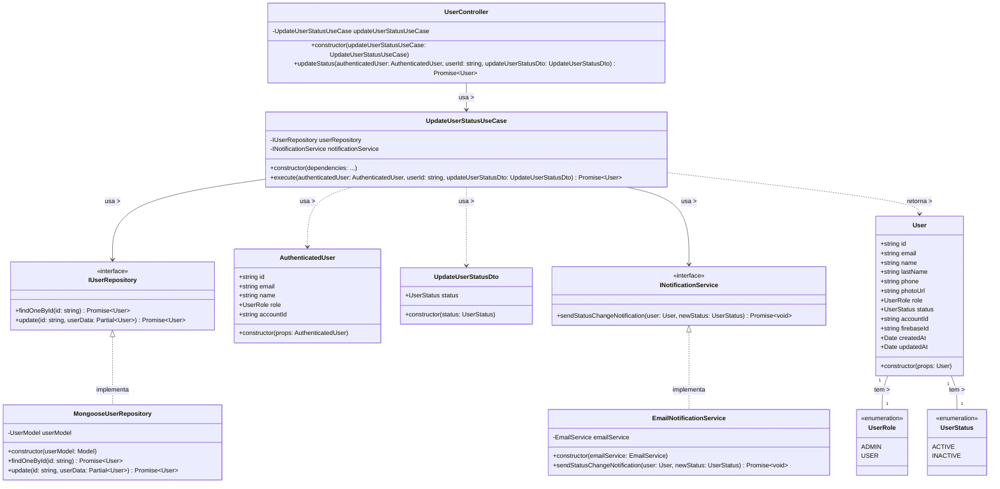

# Diagrama de Classes - Atualização de Status de Usuários

## Descrição do Diagrama de Classes

Este diagrama representa a estrutura de classes envolvidas no processo de atualização de status de usuários no sistema tuhogar-api.

### Entidades de Domínio
- **User**: Representa um usuário no sistema com seus atributos
- **UserRole**: Enumeração que define os possíveis papéis de um usuário (ADMIN, USER)
- **UserStatus**: Enumeração que define os possíveis estados de um usuário (ACTIVE, INACTIVE)
- **AuthenticatedUser**: Representa um usuário autenticado com informações reduzidas
- **UpdateUserStatusDto**: Objeto de transferência de dados que contém o novo status do usuário

### Interfaces
- **IUserRepository**: Interface para acesso e manipulação dos dados de usuários
- **INotificationService**: Interface para envio de notificações

### Casos de Uso
- **UpdateUserStatusUseCase**: Orquestra o processo de atualização de status de um usuário

### Implementações
- **MongooseUserRepository**: Implementação do repositório de usuários usando MongoDB/Mongoose
- **EmailNotificationService**: Implementação do serviço de notificação por email
- **UserController**: Controlador HTTP para endpoints relacionados a usuários

### Relações
- Um User tem um UserRole e um UserStatus
- MongooseUserRepository implementa IUserRepository
- EmailNotificationService implementa INotificationService
- UpdateUserStatusUseCase depende de IUserRepository e INotificationService
- UserController depende de UpdateUserStatusUseCase
- UpdateUserStatusUseCase usa AuthenticatedUser e UpdateUserStatusDto, e retorna User

### Responsabilidades
- O UpdateUserStatusUseCase coordena todo o processo de atualização de status, incluindo:
  - Verificação de permissões
  - Verificação de existência do usuário
  - Validação do novo status
  - Atualização do status no banco de dados
  - Notificação do usuário sobre a mudança

Este diagrama segue os princípios de Clean Architecture, com separação clara entre entidades de domínio, casos de uso, interfaces e implementações.
