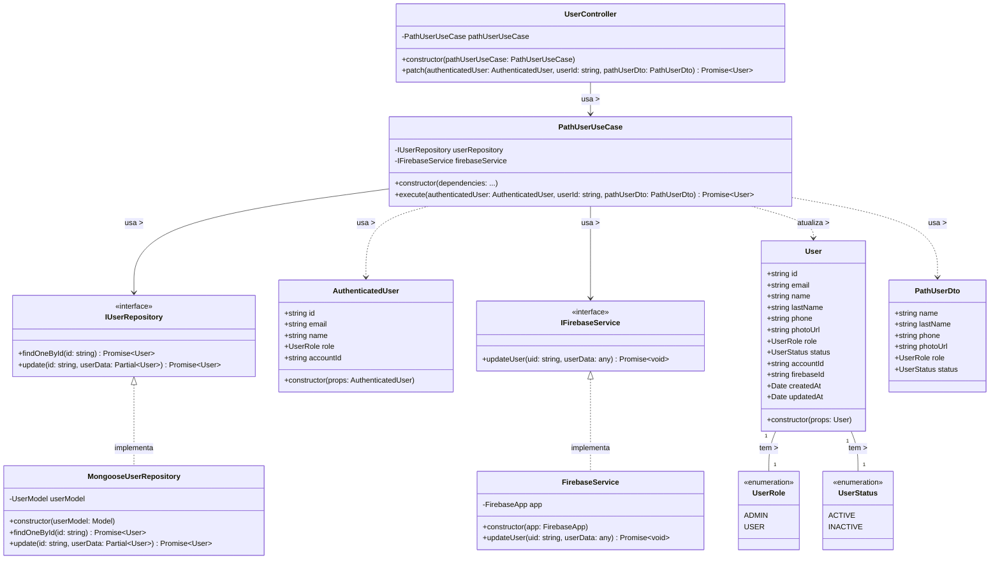

# Diagrama de Classes - Atualização de Dados de Usuários

## Descrição do Diagrama de Classes

Este diagrama representa a estrutura de classes envolvidas no processo de atualização de dados de usuários no sistema tuhogar-api.

### Entidades de Domínio
- **User**: Representa um usuário no sistema com seus atributos
- **UserRole**: Enumeração que define os possíveis papéis de um usuário (ADMIN, USER)
- **UserStatus**: Enumeração que define os possíveis estados de um usuário (ACTIVE, INACTIVE)
- **AuthenticatedUser**: Representa um usuário autenticado com informações reduzidas

### Interfaces
- **IUserRepository**: Interface para acesso e manipulação dos dados de usuários
- **IFirebaseService**: Interface para interação com o serviço Firebase

### Casos de Uso
- **PathUserUseCase**: Orquestra o processo de atualização parcial (patch) de um usuário

### DTOs (Data Transfer Objects)
- **PathUserDto**: Objeto para transferência de dados durante a atualização de usuário

### Implementações
- **MongooseUserRepository**: Implementação do repositório de usuários usando MongoDB/Mongoose
- **FirebaseService**: Implementação do serviço de interação com Firebase
- **UserController**: Controlador HTTP para endpoints relacionados a usuários

### Relações
- Um User tem um UserRole e um UserStatus
- MongooseUserRepository implementa IUserRepository
- FirebaseService implementa IFirebaseService
- PathUserUseCase depende de IUserRepository e IFirebaseService
- UserController depende de PathUserUseCase
- PathUserUseCase usa PathUserDto e AuthenticatedUser, e atualiza User

Este diagrama segue os princípios de Clean Architecture, com separação clara entre entidades de domínio, casos de uso, interfaces e implementações.
