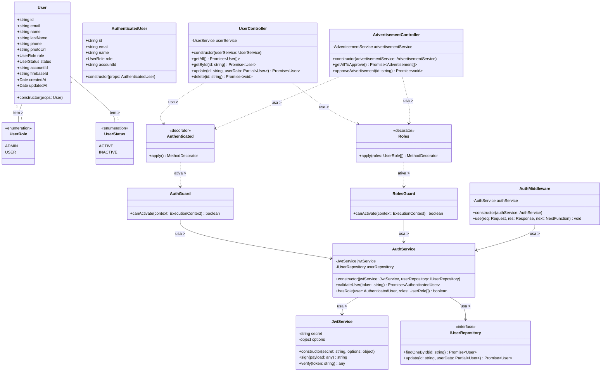

# Diagrama de Classes - Controle de Níveis de Acesso por Perfis

## Descrição do Diagrama de Classes

Este diagrama representa a estrutura de classes envolvidas no sistema de controle de níveis de acesso por perfis no tuhogar-api.

### Entidades de Domínio
- **User**: Representa um usuário no sistema com seus atributos, incluindo o papel (role)
- **UserRole**: Enumeração que define os possíveis papéis de um usuário (ADMIN, USER)
- **UserStatus**: Enumeração que define os possíveis estados de um usuário (ACTIVE, INACTIVE)
- **AuthenticatedUser**: Representa um usuário autenticado com informações reduzidas

### Interfaces
- **IUserRepository**: Interface para acesso e manipulação dos dados de usuários

### Decoradores e Guardas
- **Authenticated**: Decorador que indica que um endpoint requer autenticação
- **AuthGuard**: Guarda que verifica se o usuário está autenticado
- **RolesGuard**: Guarda que verifica se o usuário tem os papéis necessários
- **Roles**: Decorador que especifica quais papéis são necessários para acessar um endpoint

### Serviços
- **JwtService**: Serviço para geração e validação de tokens JWT
- **AuthService**: Serviço que gerencia a autenticação e autorização de usuários

### Controladores
- **UserController**: Controlador para operações relacionadas a usuários
- **AdvertisementController**: Controlador para operações relacionadas a anúncios

### Middleware
- **AuthMiddleware**: Middleware que intercepta requisições para verificar autenticação

### Relações
- Um User tem um UserRole e um UserStatus
- AuthGuard e RolesGuard dependem de AuthService
- AuthService depende de JwtService e IUserRepository
- AuthMiddleware depende de AuthService
- Os decoradores Authenticated e Roles ativam os guardas AuthGuard e RolesGuard
- Os controladores usam os decoradores para proteger seus endpoints

### Funcionamento do Sistema de Controle de Acesso
1. Cada requisição passa pelo AuthMiddleware, que extrai e valida o token JWT
2. Os endpoints protegidos são decorados com @Authenticated() e @Roles([UserRole.ADMIN])
3. O AuthGuard verifica se o usuário está autenticado
4. O RolesGuard verifica se o usuário tem os papéis necessários
5. Apenas usuários com os papéis adequados podem acessar funcionalidades restritas

Este diagrama segue os princípios de segurança por design, com múltiplas camadas de verificação de permissões.
