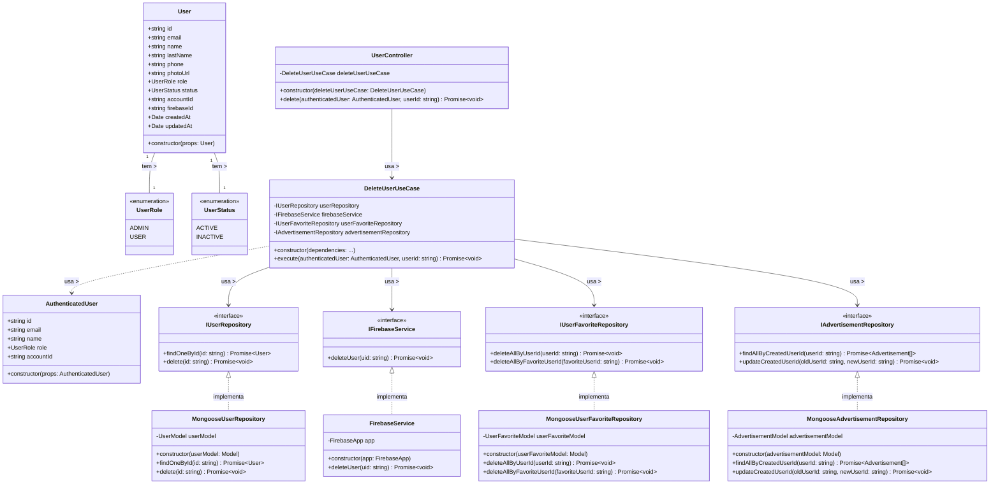

# Diagrama de Classes - Exclusão de Usuários

## Descrição do Diagrama de Classes

Este diagrama representa a estrutura de classes envolvidas no processo de exclusão de usuários no sistema tuhogar-api.

### Entidades de Domínio
- **User**: Representa um usuário no sistema com seus atributos
- **UserRole**: Enumeração que define os possíveis papéis de um usuário (ADMIN, USER)
- **UserStatus**: Enumeração que define os possíveis estados de um usuário (ACTIVE, INACTIVE)
- **AuthenticatedUser**: Representa um usuário autenticado com informações reduzidas

### Interfaces
- **IUserRepository**: Interface para acesso e manipulação dos dados de usuários
- **IFirebaseService**: Interface para interação com o serviço Firebase
- **IUserFavoriteRepository**: Interface para acesso e manipulação dos dados de usuários favoritos
- **IAdvertisementRepository**: Interface para acesso e manipulação dos dados de anúncios

### Casos de Uso
- **DeleteUserUseCase**: Orquestra o processo de exclusão de um usuário

### Implementações
- **MongooseUserRepository**: Implementação do repositório de usuários usando MongoDB/Mongoose
- **FirebaseService**: Implementação do serviço de interação com Firebase
- **MongooseUserFavoriteRepository**: Implementação do repositório de usuários favoritos
- **MongooseAdvertisementRepository**: Implementação do repositório de anúncios
- **UserController**: Controlador HTTP para endpoints relacionados a usuários

### Relações
- Um User tem um UserRole e um UserStatus
- MongooseUserRepository implementa IUserRepository
- FirebaseService implementa IFirebaseService
- MongooseUserFavoriteRepository implementa IUserFavoriteRepository
- MongooseAdvertisementRepository implementa IAdvertisementRepository
- DeleteUserUseCase depende de IUserRepository, IFirebaseService, IUserFavoriteRepository e IAdvertisementRepository
- UserController depende de DeleteUserUseCase
- DeleteUserUseCase usa AuthenticatedUser

### Responsabilidades
- O DeleteUserUseCase coordena todo o processo de exclusão, incluindo:
  - Verificação de permissões
  - Verificação de dependências
  - Exclusão no Firebase
  - Exclusão no sistema
  - Tratamento de dados relacionados (favoritos, anúncios, etc.)

Este diagrama segue os princípios de Clean Architecture, com separação clara entre entidades de domínio, casos de uso, interfaces e implementações.
