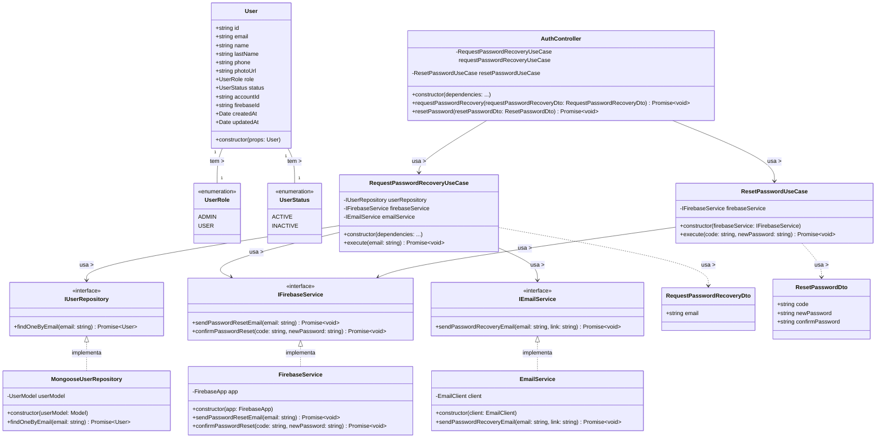

# Diagrama de Classes - Recuperação de Senha

## Descrição do Diagrama de Classes

Este diagrama representa a estrutura de classes envolvidas no processo de recuperação de senha no sistema tuhogar-api.

### Entidades de Domínio
- **User**: Representa um usuário no sistema com seus atributos
- **UserRole**: Enumeração que define os possíveis papéis de um usuário (ADMIN, USER)
- **UserStatus**: Enumeração que define os possíveis estados de um usuário (ACTIVE, INACTIVE)

### Interfaces
- **IUserRepository**: Interface para acesso aos dados de usuários
- **IFirebaseService**: Interface para interação com o serviço Firebase
- **IEmailService**: Interface para envio de emails

### Casos de Uso
- **RequestPasswordRecoveryUseCase**: Orquestra o processo de solicitação de recuperação de senha
- **ResetPasswordUseCase**: Orquestra o processo de redefinição de senha

### DTOs (Data Transfer Objects)
- **RequestPasswordRecoveryDto**: Objeto para transferência de dados durante a solicitação de recuperação
- **ResetPasswordDto**: Objeto para transferência de dados durante a redefinição de senha

### Implementações
- **MongooseUserRepository**: Implementação do repositório de usuários usando MongoDB/Mongoose
- **FirebaseService**: Implementação do serviço de interação com Firebase
- **EmailService**: Implementação do serviço de envio de emails
- **AuthController**: Controlador HTTP para endpoints relacionados à autenticação

### Relações
- Um User tem um UserRole e um UserStatus
- MongooseUserRepository implementa IUserRepository
- FirebaseService implementa IFirebaseService
- EmailService implementa IEmailService
- RequestPasswordRecoveryUseCase depende de IUserRepository, IFirebaseService e IEmailService
- ResetPasswordUseCase depende de IFirebaseService
- AuthController depende de RequestPasswordRecoveryUseCase e ResetPasswordUseCase
- Os casos de uso utilizam os respectivos DTOs

Este diagrama segue os princípios de Clean Architecture, com separação clara entre entidades de domínio, casos de uso, interfaces e implementações.
