# Diagrama de Classes - Gerenciamento de Usuários Favoritos

```mermaid
classDiagram
    %% Entidades de Domínio
    class User {
        +string id
        +string email
        +string name
        +string lastName
        +string phone
        +string photoUrl
        +UserRole role
        +UserStatus status
        +string accountId
        +string firebaseId
        +Date createdAt
        +Date updatedAt
        +constructor(props: User)
    }
    
    class UserRole {
        <<enumeration>>
        ADMIN
        USER
    }
    
    class UserStatus {
        <<enumeration>>
        ACTIVE
        INACTIVE
    }
    
    class UserFavorite {
        +string id
        +string userId
        +string favoriteUserId
        +Date createdAt
        +constructor(props: UserFavorite)
    }
    
    class AuthenticatedUser {
        +string id
        +string email
        +string name
        +UserRole role
        +string accountId
        +constructor(props: AuthenticatedUser)
    }
    
    %% Interfaces
    class IUserRepository {
        <<interface>>
        +findOneById(id: string) Promise~User~
    }
    
    class IUserFavoriteRepository {
        <<interface>>
        +create(userFavorite: UserFavorite) Promise~UserFavorite~
        +delete(userId: string, favoriteUserId: string) Promise~void~
        +findAllByUserId(userId: string) Promise~UserFavorite[]~
        +findOneByUserIdAndFavoriteUserId(userId: string, favoriteUserId: string) Promise~UserFavorite~
    }
    
    %% Casos de Uso
    class CreateFavoriteUserUseCase {
        -IUserRepository userRepository
        -IUserFavoriteRepository userFavoriteRepository
        +constructor(dependencies: ...)
        +execute(authenticatedUser: AuthenticatedUser, favoriteUserId: string) Promise~UserFavorite~
    }
    
    class DeleteFavoriteUserUseCase {
        -IUserFavoriteRepository userFavoriteRepository
        +constructor(userFavoriteRepository: IUserFavoriteRepository)
        +execute(authenticatedUser: AuthenticatedUser, favoriteUserId: string) Promise~void~
    }
    
    class GetFavoritesUserUseCase {
        -IUserFavoriteRepository userFavoriteRepository
        -IUserRepository userRepository
        +constructor(dependencies: ...)
        +execute(authenticatedUser: AuthenticatedUser) Promise~User[]~
    }
    
    %% Implementações
    class MongooseUserRepository {
        -UserModel userModel
        +constructor(userModel: Model)
        +findOneById(id: string) Promise~User~
    }
    
    class MongooseUserFavoriteRepository {
        -UserFavoriteModel userFavoriteModel
        +constructor(userFavoriteModel: Model)
        +create(userFavorite: UserFavorite) Promise~UserFavorite~
        +delete(userId: string, favoriteUserId: string) Promise~void~
        +findAllByUserId(userId: string) Promise~UserFavorite[]~
        +findOneByUserIdAndFavoriteUserId(userId: string, favoriteUserId: string) Promise~UserFavorite~
    }
    
    class UserController {
        -CreateFavoriteUserUseCase createFavoriteUserUseCase
        -DeleteFavoriteUserUseCase deleteFavoriteUserUseCase
        -GetFavoritesUserUseCase getFavoritesUserUseCase
        +constructor(dependencies: ...)
        +addFavorite(authenticatedUser: AuthenticatedUser, favoriteUserId: string) Promise~UserFavorite~
        +removeFavorite(authenticatedUser: AuthenticatedUser, favoriteUserId: string) Promise~void~
        +getFavorites(authenticatedUser: AuthenticatedUser) Promise~User[]~
    }
    
    %% Relações
    User "1" -- "1" UserRole : tem >
    User "1" -- "1" UserStatus : tem >
    User "1" -- "*" UserFavorite : possui >
    
    IUserRepository <|.. MongooseUserRepository : implementa
    IUserFavoriteRepository <|.. MongooseUserFavoriteRepository : implementa
    
    CreateFavoriteUserUseCase --> IUserRepository : usa >
    CreateFavoriteUserUseCase --> IUserFavoriteRepository : usa >
    
    DeleteFavoriteUserUseCase --> IUserFavoriteRepository : usa >
    
    GetFavoritesUserUseCase --> IUserFavoriteRepository : usa >
    GetFavoritesUserUseCase --> IUserRepository : usa >
    
    UserController --> CreateFavoriteUserUseCase : usa >
    UserController --> DeleteFavoriteUserUseCase : usa >
    UserController --> GetFavoritesUserUseCase : usa >
    
    CreateFavoriteUserUseCase ..> UserFavorite : cria >
    CreateFavoriteUserUseCase ..> AuthenticatedUser : usa >
    
    DeleteFavoriteUserUseCase ..> AuthenticatedUser : usa >
    
    GetFavoritesUserUseCase ..> AuthenticatedUser : usa >
    GetFavoritesUserUseCase ..> User : retorna >
```

## Descrição do Diagrama de Classes

Este diagrama representa a estrutura de classes envolvidas no sistema de gerenciamento de usuários favoritos no tuhogar-api.

### Entidades de Domínio
- **User**: Representa um usuário no sistema com seus atributos
- **UserRole**: Enumeração que define os possíveis papéis de um usuário (ADMIN, USER)
- **UserStatus**: Enumeração que define os possíveis estados de um usuário (ACTIVE, INACTIVE)
- **UserFavorite**: Representa a relação de favorito entre dois usuários
- **AuthenticatedUser**: Representa um usuário autenticado com informações reduzidas

### Interfaces
- **IUserRepository**: Interface para acesso aos dados de usuários
- **IUserFavoriteRepository**: Interface para acesso e manipulação dos dados de usuários favoritos

### Casos de Uso
- **CreateFavoriteUserUseCase**: Orquestra o processo de adicionar um usuário aos favoritos
- **DeleteFavoriteUserUseCase**: Orquestra o processo de remover um usuário dos favoritos
- **GetFavoritesUserUseCase**: Orquestra o processo de listar os usuários favoritos

### Implementações
- **MongooseUserRepository**: Implementação do repositório de usuários usando MongoDB/Mongoose
- **MongooseUserFavoriteRepository**: Implementação do repositório de usuários favoritos usando MongoDB/Mongoose
- **UserController**: Controlador HTTP para endpoints relacionados a usuários e favoritos

### Relações
- Um User tem um UserRole e um UserStatus
- Um User pode possuir múltiplos UserFavorite
- MongooseUserRepository implementa IUserRepository
- MongooseUserFavoriteRepository implementa IUserFavoriteRepository
- Os casos de uso dependem das interfaces de repositório
- UserController depende dos casos de uso
- CreateFavoriteUserUseCase cria UserFavorite e usa AuthenticatedUser
- DeleteFavoriteUserUseCase e GetFavoritesUserUseCase usam AuthenticatedUser
- GetFavoritesUserUseCase retorna uma lista de User

Este diagrama segue os princípios de Clean Architecture, com separação clara entre entidades de domínio, casos de uso, interfaces e implementações.
