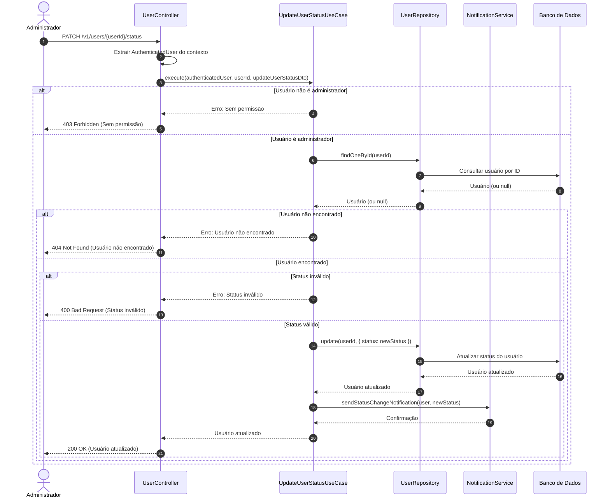

# Diagrama de Sequência - Atualização de Status de Usuários

## Descrição do Diagrama de Sequência

Este diagrama ilustra o fluxo de interações durante o processo de atualização de status de um usuário no sistema tuhogar-api.

### Participantes
- **Administrador**: Pessoa com privilégios elevados que está solicitando a atualização de status
- **UserController**: Componente que recebe e processa requisições HTTP
- **UpdateUserStatusUseCase**: Componente que orquestra a lógica de negócio para atualização de status
- **UserRepository**: Componente responsável pelo acesso e manipulação dos dados de usuários
- **NotificationService**: Componente responsável pelo envio de notificações
- **Banco de Dados**: Sistema de armazenamento persistente

### Fluxo Principal
1. O administrador envia uma requisição PATCH para `/v1/users/{userId}/status`
2. O controlador extrai o usuário autenticado do contexto da requisição
3. O controlador chama o caso de uso de atualização de status
4. O caso de uso verifica se o usuário autenticado é um administrador
5. Se for um administrador:
   - Verifica se o usuário a ter o status atualizado existe
   - Se o usuário existir:
     - Valida se o novo status é válido
     - Se o status for válido:
       - Atualiza o status do usuário no banco de dados
       - Notifica o usuário sobre a mudança de status
       - Retorna o usuário atualizado
6. O controlador responde à requisição com o usuário atualizado ou uma mensagem de erro

### Cenários Alternativos
- **Usuário não é administrador**: O sistema retorna um erro 403 Forbidden
- **Usuário não encontrado**: O sistema retorna um erro 404 Not Found
- **Status inválido**: O sistema retorna um erro 400 Bad Request

### Regras de Permissão
- Apenas administradores podem atualizar o status de usuários

### Validações
- O usuário a ter o status atualizado deve existir
- O novo status deve ser um valor válido (ACTIVE ou INACTIVE)

### Efeitos Colaterais
- O usuário é notificado sobre a mudança de status
- A mudança de status pode afetar o acesso do usuário ao sistema
