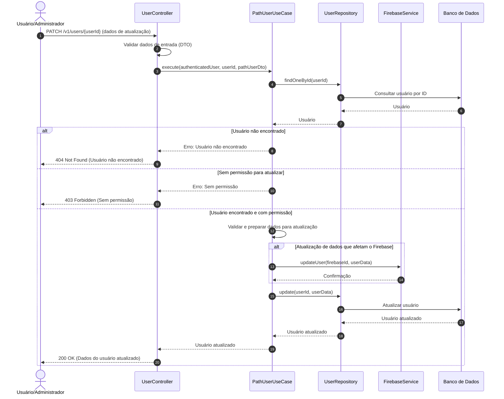

# Diagrama de Sequência - Atualização de Dados de Usuários

## Descrição do Diagrama de Sequência

Este diagrama ilustra o fluxo de interações durante o processo de atualização de dados de um usuário no sistema tuhogar-api.

### Participantes
- **Usuário/Administrador**: Pessoa que está solicitando a atualização de dados
- **UserController**: Componente que recebe e processa requisições HTTP
- **PathUserUseCase**: Componente que orquestra a lógica de negócio para atualização de usuários
- **UserRepository**: Componente responsável pelo acesso e manipulação dos dados de usuários
- **FirebaseService**: Serviço que interage com o Firebase para autenticação
- **Banco de Dados**: Sistema de armazenamento persistente

### Fluxo Principal
1. O usuário ou administrador envia uma requisição PATCH para `/v1/users/{userId}` com os dados a serem atualizados
2. O controlador valida os dados de entrada usando DTOs
3. O controlador chama o caso de uso de atualização de usuário
4. O caso de uso busca o usuário no banco de dados pelo ID
5. Se o usuário for encontrado e o solicitante tiver permissão:
   - Valida e prepara os dados para atualização
   - Se necessário, atualiza os dados no Firebase
   - Atualiza os dados do usuário no banco de dados
   - Retorna os dados do usuário atualizado
6. O controlador responde à requisição com os dados do usuário atualizado ou uma mensagem de erro

### Cenários Alternativos
- **Usuário não encontrado**: O sistema retorna um erro 404 Not Found
- **Sem permissão para atualizar**: O sistema retorna um erro 403 Forbidden
- **Falha na atualização no Firebase**: O sistema retorna um erro (não mostrado explicitamente no diagrama)
- **Falha na atualização no banco de dados**: O sistema retorna um erro (não mostrado explicitamente no diagrama)

### Regras de Permissão
- Um usuário comum só pode atualizar seus próprios dados
- Um administrador pode atualizar dados de qualquer usuário
- Algumas informações (como papel/role) só podem ser atualizadas por administradores
