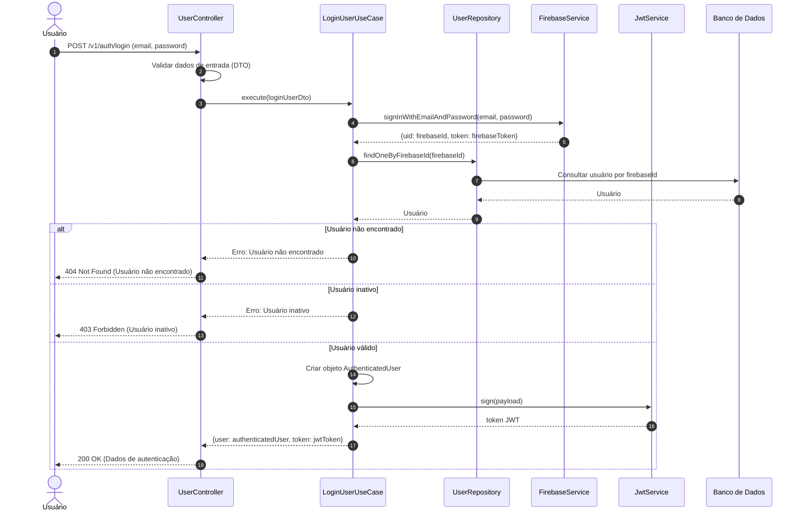

# Diagrama de Sequência - Autenticação de Usuários (Login)

## Descrição do Diagrama de Sequência

Este diagrama ilustra o fluxo de interações durante o processo de autenticação de um usuário (login) no sistema tuhogar-api.

### Participantes
- **Usuário**: Pessoa que está tentando se autenticar no sistema
- **UserController**: Componente que recebe e processa requisições HTTP
- **LoginUserUseCase**: Componente que orquestra a lógica de negócio para autenticação
- **UserRepository**: Componente responsável pelo acesso aos dados de usuários
- **FirebaseService**: Serviço que interage com o Firebase para autenticação
- **JwtService**: Serviço para geração de tokens JWT
- **Banco de Dados**: Sistema de armazenamento persistente

### Fluxo Principal
1. O usuário envia uma requisição POST para `/v1/auth/login` com email e senha
2. O controlador valida os dados de entrada usando DTOs
3. O controlador chama o caso de uso de login
4. O caso de uso autentica o usuário no Firebase
5. O caso de uso busca o usuário no banco de dados pelo ID do Firebase
6. Se o usuário for encontrado e estiver ativo:
   - Cria um objeto AuthenticatedUser com os dados necessários
   - Gera um token JWT para autorização
   - Retorna os dados de autenticação e o token
7. O controlador responde à requisição com os dados de autenticação ou uma mensagem de erro

### Cenários Alternativos
- **Usuário não encontrado**: O sistema retorna um erro 404 Not Found
- **Usuário inativo**: O sistema retorna um erro 403 Forbidden
- **Credenciais inválidas**: O Firebase retorna um erro (não mostrado explicitamente no diagrama)
- **Falha na autenticação**: O sistema retorna um erro (não mostrado explicitamente no diagrama)
