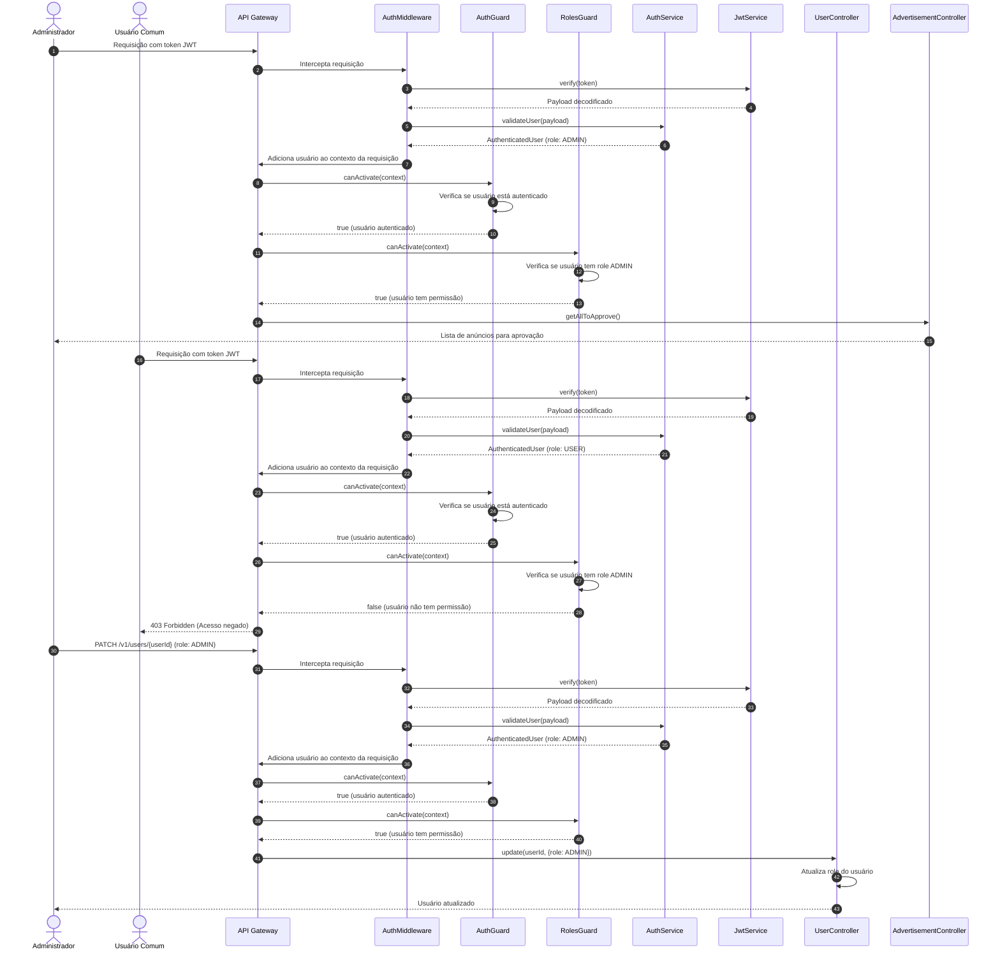

# Diagrama de Sequência - Controle de Níveis de Acesso por Perfis

## Descrição do Diagrama de Sequência

Este diagrama ilustra o fluxo de interações durante o processo de controle de níveis de acesso por perfis no sistema tuhogar-api.

### Participantes
- **Administrador**: Usuário com papel ADMIN no sistema
- **Usuário Comum**: Usuário com papel USER no sistema
- **API Gateway**: Ponto de entrada para as requisições HTTP
- **AuthMiddleware**: Middleware que intercepta requisições para verificar autenticação
- **AuthGuard**: Guarda que verifica se o usuário está autenticado
- **RolesGuard**: Guarda que verifica se o usuário tem os papéis necessários
- **AuthService**: Serviço que gerencia a autenticação e autorização de usuários
- **JwtService**: Serviço para validação de tokens JWT
- **UserController**: Controlador para operações relacionadas a usuários
- **AdvertisementController**: Controlador para operações relacionadas a anúncios

### Fluxo de Acesso do Administrador
1. O administrador envia uma requisição com um token JWT
2. O AuthMiddleware intercepta a requisição e valida o token
3. O JwtService decodifica o payload do token
4. O AuthService valida o usuário e identifica que ele tem papel ADMIN
5. O usuário autenticado é adicionado ao contexto da requisição
6. O AuthGuard verifica que o usuário está autenticado
7. O RolesGuard verifica que o usuário tem o papel ADMIN
8. A requisição é encaminhada para o controlador apropriado
9. O controlador processa a requisição e retorna a resposta

### Fluxo de Acesso do Usuário Comum
1. O usuário comum envia uma requisição com um token JWT
2. O AuthMiddleware intercepta a requisição e valida o token
3. O JwtService decodifica o payload do token
4. O AuthService valida o usuário e identifica que ele tem papel USER
5. O usuário autenticado é adicionado ao contexto da requisição
6. O AuthGuard verifica que o usuário está autenticado
7. O RolesGuard verifica que o usuário NÃO tem o papel ADMIN
8. A requisição é rejeitada com código 403 Forbidden

### Fluxo de Atribuição de Perfil
1. O administrador envia uma requisição para atualizar o papel de um usuário
2. Após passar pelas verificações de autenticação e autorização
3. O UserController atualiza o papel do usuário no sistema
4. A resposta é retornada ao administrador

### Considerações de Segurança
- Todas as requisições são validadas em múltiplas camadas
- O sistema verifica tanto a autenticação quanto a autorização
- Apenas usuários com o papel ADMIN podem acessar funcionalidades restritas
- A atribuição de papéis só pode ser realizada por administradores
