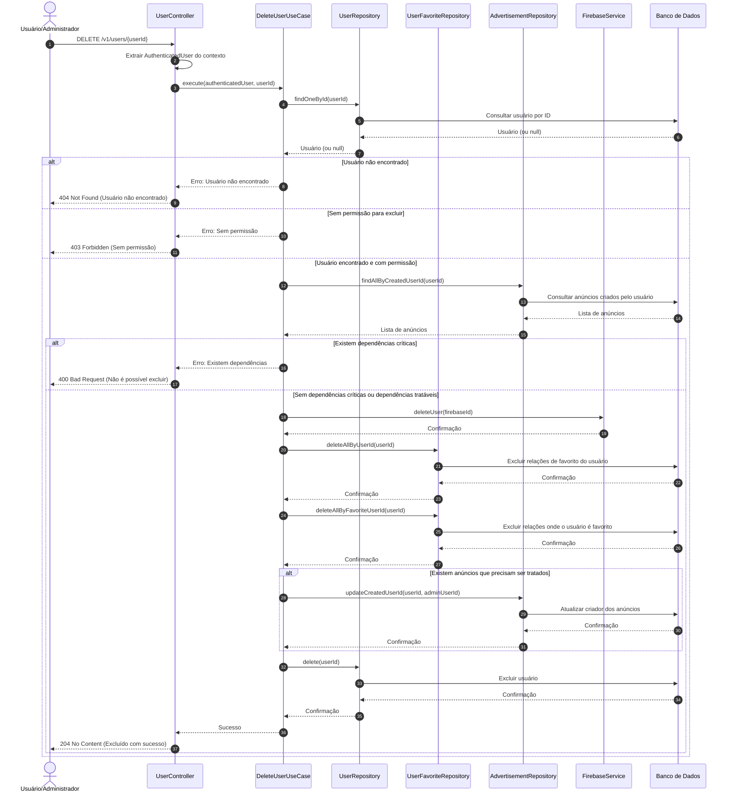

# Diagrama de Sequência - Exclusão de Usuários

## Descrição do Diagrama de Sequência

Este diagrama ilustra o fluxo de interações durante o processo de exclusão de um usuário no sistema tuhogar-api.

### Participantes
- **Usuário/Administrador**: Pessoa que está solicitando a exclusão
- **UserController**: Componente que recebe e processa requisições HTTP
- **DeleteUserUseCase**: Componente que orquestra a lógica de negócio para exclusão de usuários
- **UserRepository**: Componente responsável pelo acesso e manipulação dos dados de usuários
- **UserFavoriteRepository**: Componente responsável pelo acesso e manipulação dos dados de usuários favoritos
- **AdvertisementRepository**: Componente responsável pelo acesso e manipulação dos dados de anúncios
- **FirebaseService**: Serviço que interage com o Firebase para autenticação
- **Banco de Dados**: Sistema de armazenamento persistente

### Fluxo Principal
1. O usuário ou administrador envia uma requisição DELETE para `/v1/users/{userId}`
2. O controlador extrai o usuário autenticado do contexto da requisição
3. O controlador chama o caso de uso de exclusão de usuário
4. O caso de uso busca o usuário a ser excluído
5. Se o usuário for encontrado e o solicitante tiver permissão:
   - Verifica se existem dependências (como anúncios criados pelo usuário)
   - Se não houver dependências críticas:
     - Exclui o usuário no Firebase
     - Exclui dados relacionados (relações de favorito)
     - Trata anúncios criados pelo usuário (transferindo para um administrador)
     - Exclui o usuário no sistema
   - Retorna uma mensagem de sucesso
6. O controlador responde à requisição com uma confirmação de sucesso ou uma mensagem de erro

### Cenários Alternativos
- **Usuário não encontrado**: O sistema retorna um erro 404 Not Found
- **Sem permissão para excluir**: O sistema retorna um erro 403 Forbidden
- **Existem dependências críticas**: O sistema retorna um erro 400 Bad Request

### Regras de Permissão
- Um usuário comum só pode excluir sua própria conta
- Um administrador pode excluir qualquer conta de usuário

### Tratamento de Dependências
- Relações de favorito são excluídas
- Anúncios criados pelo usuário são transferidos para um administrador
- Outras dependências podem impedir a exclusão do usuário
