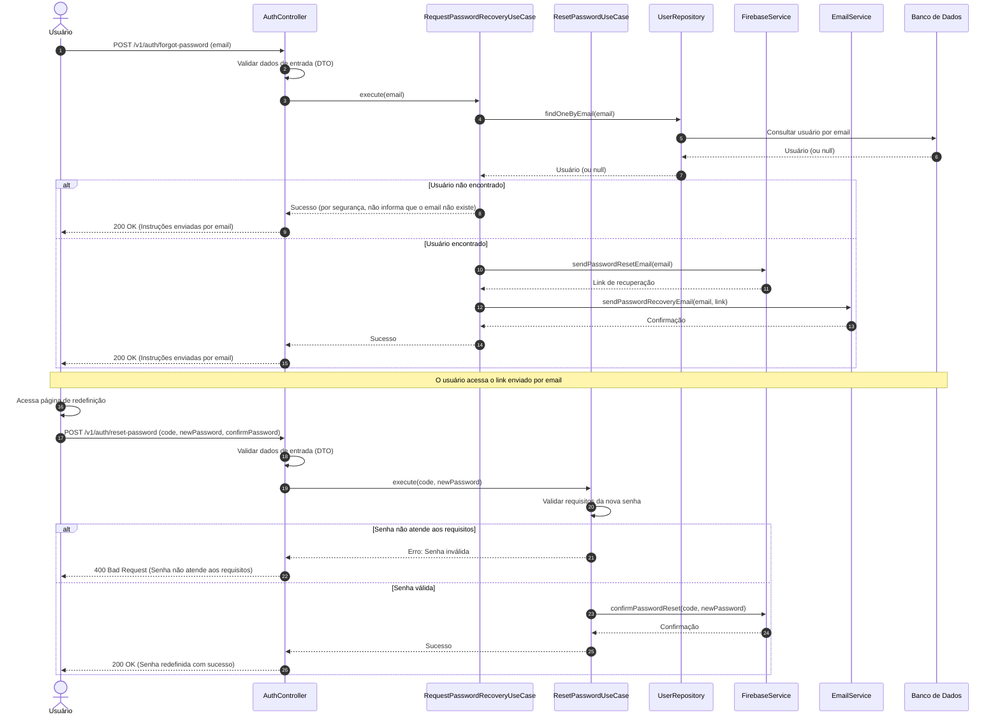

# Diagrama de Sequência - Recuperação de Senha

## Descrição do Diagrama de Sequência

Este diagrama ilustra o fluxo de interações durante o processo de recuperação de senha no sistema tuhogar-api, dividido em duas partes principais: solicitação de recuperação e redefinição de senha.

### Participantes
- **Usuário**: Pessoa que está solicitando a recuperação de senha
- **AuthController**: Componente que recebe e processa requisições HTTP
- **RequestPasswordRecoveryUseCase**: Componente que orquestra a lógica de negócio para solicitação de recuperação
- **ResetPasswordUseCase**: Componente que orquestra a lógica de negócio para redefinição de senha
- **UserRepository**: Componente responsável pelo acesso aos dados de usuários
- **FirebaseService**: Serviço que interage com o Firebase para autenticação
- **EmailService**: Serviço responsável pelo envio de emails
- **Banco de Dados**: Sistema de armazenamento persistente

### Fluxo de Solicitação de Recuperação
1. O usuário envia uma requisição POST para `/v1/auth/forgot-password` com seu email
2. O controlador valida os dados de entrada usando DTOs
3. O controlador chama o caso de uso de solicitação de recuperação
4. O caso de uso verifica se o email está associado a um usuário existente
5. Se o usuário for encontrado:
   - Solicita ao Firebase a geração de um link de recuperação
   - Envia um email com o link de recuperação
6. O controlador responde à requisição com uma mensagem de sucesso (por segurança, mesmo se o email não existir)

### Fluxo de Redefinição de Senha
1. O usuário acessa o link enviado por email e é direcionado para a página de redefinição
2. O usuário envia uma requisição POST para `/v1/auth/reset-password` com o código, nova senha e confirmação
3. O controlador valida os dados de entrada usando DTOs
4. O controlador chama o caso de uso de redefinição de senha
5. O caso de uso valida se a nova senha atende aos requisitos de segurança
6. Se a senha for válida:
   - Solicita ao Firebase a confirmação da redefinição de senha
   - Retorna uma mensagem de sucesso
7. O controlador responde à requisição com uma mensagem de sucesso ou erro

### Considerações de Segurança
- Por questões de segurança, o sistema não informa se o email fornecido existe ou não
- A validação da nova senha inclui verificações de complexidade (comprimento, caracteres especiais, etc.)
- O link de recuperação tem validade limitada e é de uso único
