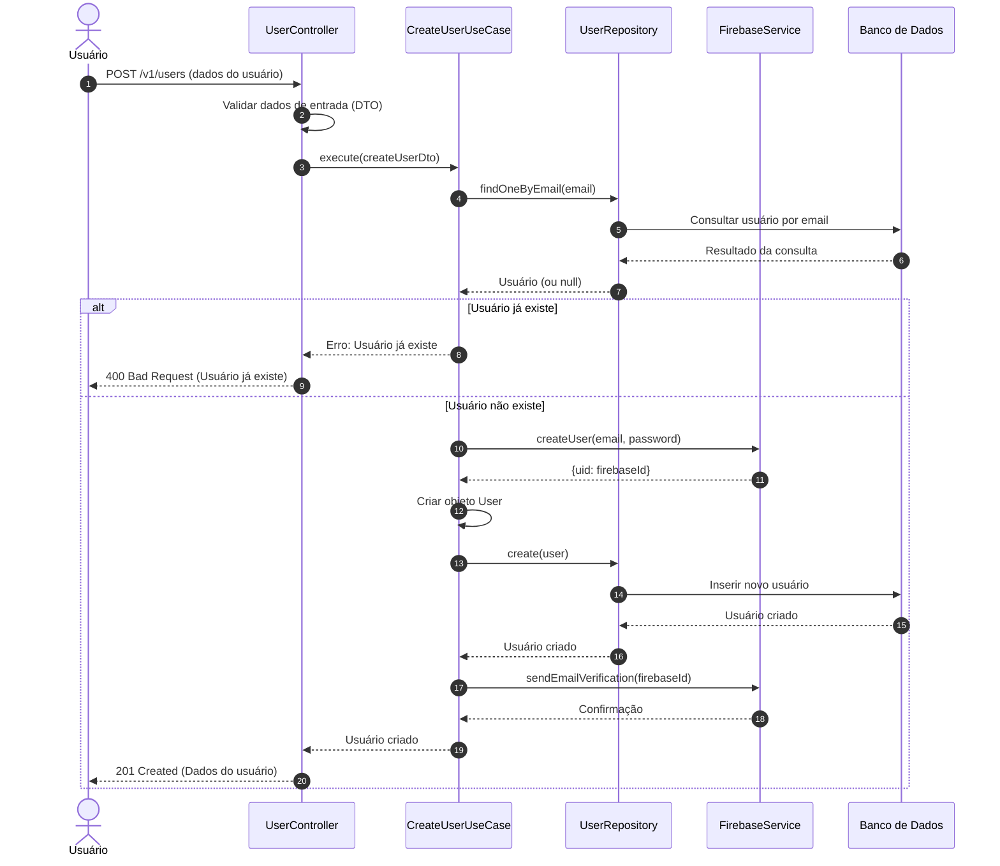

# Diagrama de Sequência - Registro de Novos Usuários

## Descrição do Diagrama de Sequência

Este diagrama ilustra o fluxo de interações durante o processo de registro de um novo usuário no sistema tuhogar-api.

### Participantes
- **Usuário**: Pessoa que está se registrando no sistema
- **UserController**: Componente que recebe e processa requisições HTTP
- **CreateUserUseCase**: Componente que orquestra a lógica de negócio para criação de usuários
- **UserRepository**: Componente responsável pela persistência de dados de usuários
- **FirebaseService**: Serviço que interage com o Firebase para autenticação
- **Banco de Dados**: Sistema de armazenamento persistente

### Fluxo Principal
1. O usuário envia uma requisição POST para `/v1/users` com os dados necessários para registro
2. O controlador valida os dados de entrada usando DTOs
3. O controlador chama o caso de uso de criação de usuário
4. O caso de uso verifica se já existe um usuário com o mesmo email
5. Se o usuário já existe, retorna um erro
6. Se o usuário não existe:
   - Cria o usuário no Firebase
   - Cria um objeto User com os dados fornecidos
   - Persiste o usuário no banco de dados
   - Envia um email de verificação através do Firebase
   - Retorna os dados do usuário criado
7. O controlador responde à requisição com os dados do usuário criado ou uma mensagem de erro

### Cenários Alternativos
- **Usuário já existe**: O sistema retorna um erro 400 Bad Request
- **Falha na criação no Firebase**: O sistema retorna um erro (não mostrado no diagrama)
- **Falha na persistência**: O sistema retorna um erro (não mostrado no diagrama)
