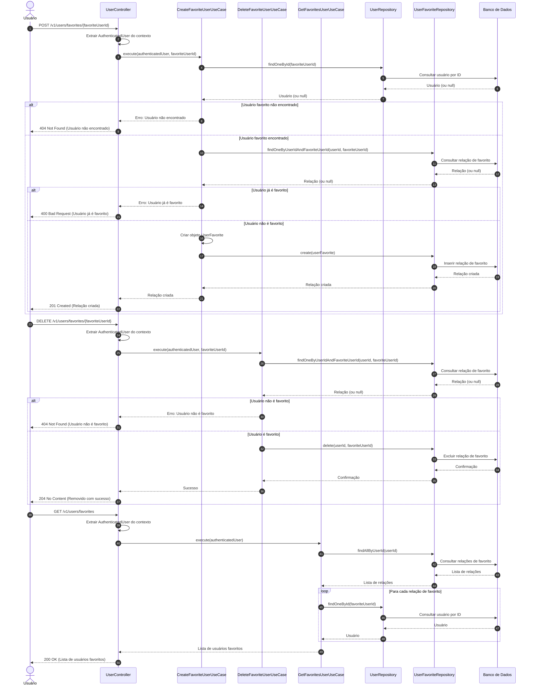

# Diagrama de Sequência - Gerenciamento de Usuários Favoritos

## Descrição do Diagrama de Sequência

Este diagrama ilustra o fluxo de interações durante os processos de gerenciamento de usuários favoritos no sistema tuhogar-api.

### Participantes
- **Usuário**: Pessoa que está utilizando o sistema
- **UserController**: Componente que recebe e processa requisições HTTP
- **CreateFavoriteUserUseCase**: Componente que orquestra a lógica de negócio para adicionar um usuário aos favoritos
- **DeleteFavoriteUserUseCase**: Componente que orquestra a lógica de negócio para remover um usuário dos favoritos
- **GetFavoritesUserUseCase**: Componente que orquestra a lógica de negócio para listar os usuários favoritos
- **UserRepository**: Componente responsável pelo acesso aos dados de usuários
- **UserFavoriteRepository**: Componente responsável pelo acesso aos dados de relações de favoritos
- **Banco de Dados**: Sistema de armazenamento persistente

### Fluxo de Adicionar Usuário aos Favoritos
1. O usuário envia uma requisição POST para `/v1/users/favorites/{favoriteUserId}`
2. O controlador extrai o usuário autenticado do contexto da requisição
3. O controlador chama o caso de uso de criação de favorito
4. O caso de uso verifica se o usuário a ser adicionado existe
5. Se o usuário existir, verifica se já é um favorito
6. Se não for um favorito, cria a relação de favorito
7. O controlador responde à requisição com os dados da relação criada ou uma mensagem de erro

### Fluxo de Remover Usuário dos Favoritos
1. O usuário envia uma requisição DELETE para `/v1/users/favorites/{favoriteUserId}`
2. O controlador extrai o usuário autenticado do contexto da requisição
3. O controlador chama o caso de uso de exclusão de favorito
4. O caso de uso verifica se o usuário é um favorito
5. Se for um favorito, remove a relação
6. O controlador responde à requisição com uma confirmação de sucesso ou uma mensagem de erro

### Fluxo de Listar Usuários Favoritos
1. O usuário envia uma requisição GET para `/v1/users/favorites`
2. O controlador extrai o usuário autenticado do contexto da requisição
3. O controlador chama o caso de uso de listagem de favoritos
4. O caso de uso busca todas as relações de favorito do usuário
5. Para cada relação, busca os dados completos do usuário favorito
6. O controlador responde à requisição com a lista de usuários favoritos

### Considerações
- Todas as operações requerem que o usuário esteja autenticado
- O sistema verifica a existência do usuário a ser adicionado aos favoritos
- O sistema verifica se um usuário já é favorito antes de adicioná-lo
- O sistema verifica se um usuário é favorito antes de removê-lo
- Ao listar os favoritos, o sistema retorna os dados completos dos usuários
